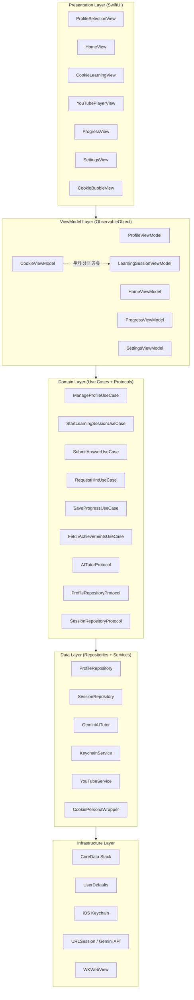
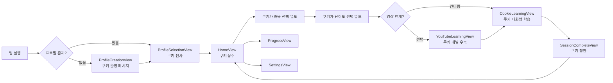
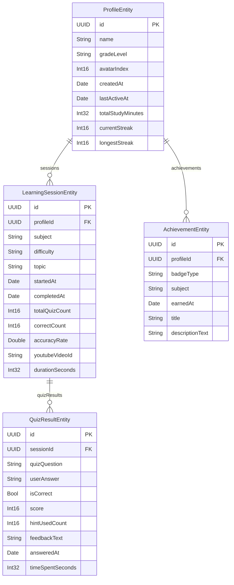
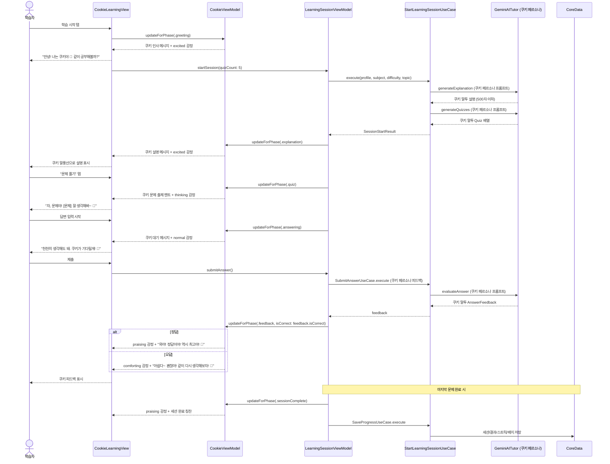
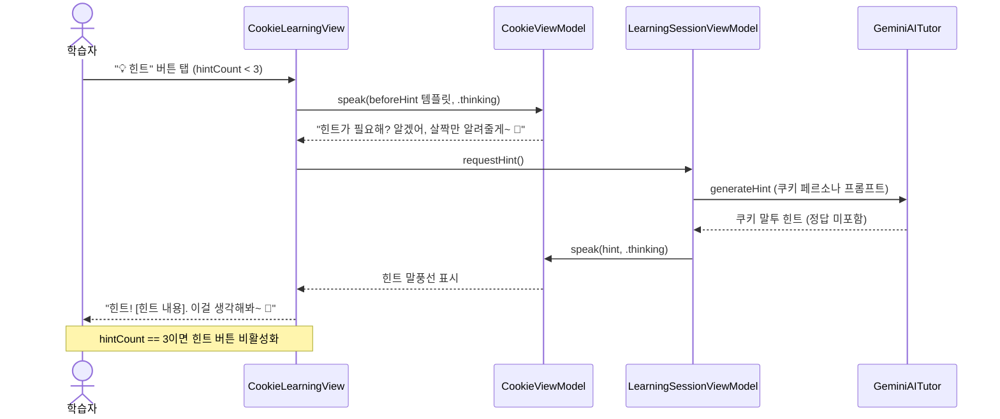
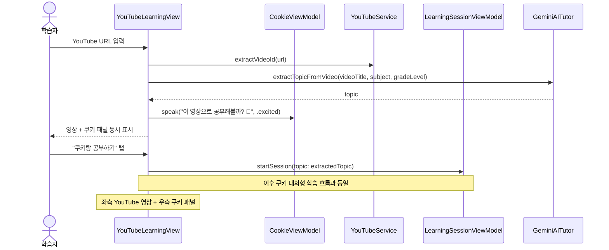
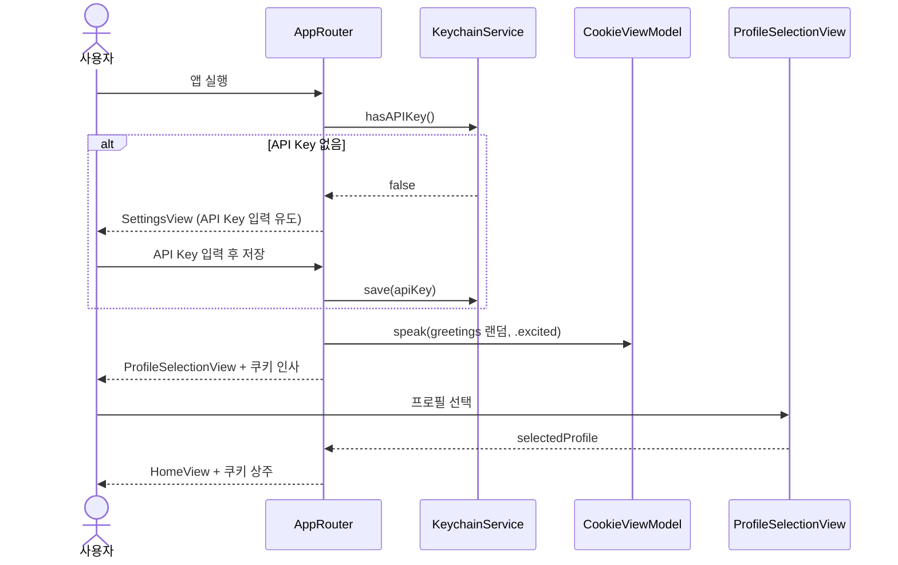
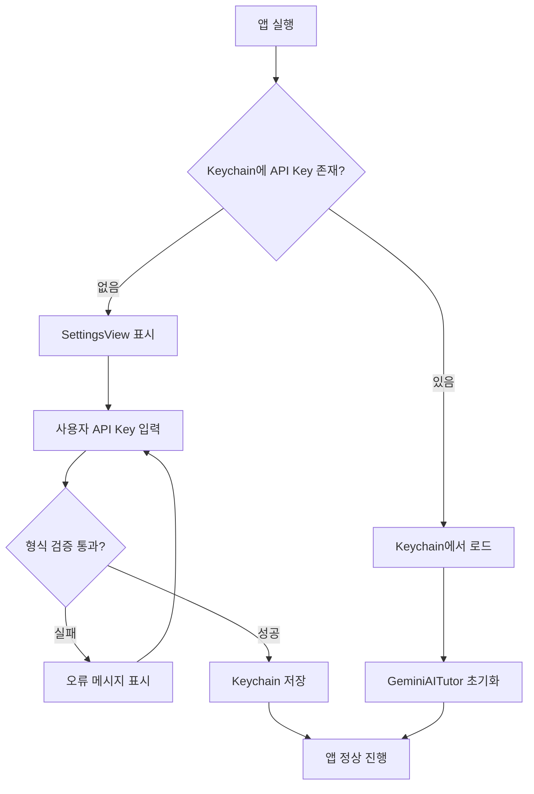

# 설계 문서: SISO-Learn — kids-ai-study-app

> 플랫폼: iPadOS 16.0+ | 언어: Swift 5.9+ | UI: SwiftUI | 아키텍처: MVVM + Clean Architecture

---

## 목차

1. [개요](#1-개요)
2. [쿠키 캐릭터 시스템](#2-쿠키-캐릭터-시스템)
3. [시스템 아키텍처](#3-시스템-아키텍처)
4. [모듈 구조](#4-모듈-구조)
5. [AI 연동 설계](#5-ai-연동-설계)
6. [CoreData DB 설계](#6-coredata-db-설계)
7. [주요 화면별 ViewModel 설계](#7-주요-화면별-viewmodel-설계)
8. [데이터 흐름 다이어그램](#8-데이터-흐름-다이어그램)
9. [API 인터페이스 설계](#9-api-인터페이스-설계)
10. [보안 설계](#10-보안-설계)
11. [YouTube 연동 설계](#11-youtube-연동-설계)
12. [에러 처리 전략](#12-에러-처리-전략)
13. [테스트 전략](#13-테스트-전략)
14. [성능 고려사항](#14-성능-고려사항)
15. [의존성](#15-의존성)

---

## 1. 개요

SISO-Learn은 중학교 2학년과 초등학교 5학년 두 자녀를 위한 iPad 기반 AI 인터랙티브 학습 앱이다. 아이들이 좋아하는 강아지 캐릭터 **쿠키(Cookie)** 가 AI 선생님 역할을 맡아 대화 형식으로 학습을 이끌어간다. 단순한 입력-출력 방식이 아닌, 쿠키가 먼저 말을 걸고 질문하고 반응하는 **대화형 학습 흐름**이 핵심이다.

Google Gemini API를 활용해 학년별 맞춤 설명과 Quiz를 제공하고, YouTube 영상 시청과 쿠키와의 AI 채팅을 동시에 진행하는 쌍방향 학습 경험을 제공한다. 정답을 직접 알려주지 않는 단계적 힌트 시스템과 학습 진행 현황 추적으로 자기주도 학습 습관을 형성한다.

핵심 설계 원칙은 네 가지다: (1) **쿠키 캐릭터 페르소나** — 모든 AI 응답은 쿠키의 말투와 감정 표현으로 래핑, (2) AI 제공자 교체 가능성을 위한 `AITutorProtocol` 추상화, (3) 기능별 독립 모듈 분리로 단계적 개발 지원, (4) MVVM + Clean Architecture로 테스트 가능성과 유지보수성 확보.

---

## 2. 쿠키 캐릭터 시스템

### 2.1 쿠키 캐릭터 개요

| 항목 | 내용 |
|------|------|
| 이름 | 쿠키 (Cookie) 🐶 |
| 종류 | 강아지 (아이들이 좋아하는 실제 반려견 이름에서 착안) |
| 역할 | AI 학습 선생님 — 설명, 질문, 힌트, 피드백을 모두 쿠키의 말투로 전달 |
| 말투 | 친근하고 귀여운 반말/존댓말 혼용, 강아지 의성어(멍멍, 왈왈) 가끔 사용 |
| 감정 상태 | 5가지: 기본(😊), 신남(🐾), 칭찬(🎉), 고민(🤔), 위로(🥺) |
| 표시 위치 | 화면 좌하단 고정 말풍선 + 캐릭터 이미지 |

### 2.2 쿠키 대화 UX 흐름

단순한 "설명 → 입력 → 결과" 방식 대신, 쿠키가 **먼저 말을 걸고 대화를 이끌어가는** 방식으로 설계한다.

```
[앱 진입]
쿠키: "안녕! 나는 쿠키야 🐶 오늘도 같이 공부해볼까? 멍멍!"

[과목 선택 유도]
쿠키: "오늘은 어떤 걸 공부하고 싶어? 수학? 영어? 아니면 다른 거?"
→ 아이가 과목 탭

[학습 시작]
쿠키: "좋아! [과목] 공부 시작이야~ 쿠키가 설명해줄게, 잘 들어봐! 🐾"
→ 쿠키가 설명 말풍선으로 전달 (500자 이하)

[Quiz 출제]
쿠키: "설명 다 들었지? 그럼 문제 나간다! 잘 생각해봐~ 🤔"
→ 문제 표시

[답변 대기 중]
쿠키: "천천히 생각해도 돼. 쿠키가 기다릴게! 🐶"

[힌트 요청 시]
쿠키: "힌트가 필요해? 알겠어, 살짝만 알려줄게~ (정답은 비밀이야!)"

[정답 시]
쿠키: "와아! 정답이야! 역시 [이름]은 최고야! 🎉 멍멍!"

[오답 시]
쿠키: "아, 아쉽다~ 괜찮아! 이렇게 생각하면 돼. 같이 다시 해보자! 🥺"

[세션 완료]
쿠키: "오늘 공부 끝! [이름] 정말 열심히 했어. 쿠키가 자랑스러워! 🐾🎉"
```

### 2.3 쿠키 감정 상태 정의

```swift
// Modules/Cookie/Domain/Entities/CookieEmotion.swift

enum CookieEmotion: String, CaseIterable {
    case normal    = "normal"    // 기본 대기 상태 😊
    case excited   = "excited"   // 학습 시작, 새 주제 🐾
    case praising  = "praising"  // 정답, 칭찬 🎉
    case thinking  = "thinking"  // 문제 출제, 힌트 고민 중 🤔
    case comforting = "comforting" // 오답, 격려 🥺
    
    var emoji: String {
        switch self {
        case .normal:     return "😊"
        case .excited:    return "🐾"
        case .praising:   return "🎉"
        case .thinking:   return "🤔"
        case .comforting: return "🥺"
        }
    }
    
    /// 학습 단계에 따른 자동 감정 매핑
    static func from(phase: LearningPhase, isCorrect: Bool? = nil) -> CookieEmotion {
        switch phase {
        case .greeting:    return .excited
        case .explanation: return .excited
        case .quiz:        return .thinking
        case .answering:   return .normal
        case .hintRequested: return .thinking
        case .feedback:
            guard let correct = isCorrect else { return .normal }
            return correct ? .praising : .comforting
        case .sessionComplete: return .praising
        }
    }
}
```

### 2.4 쿠키 말풍선 UI 컴포넌트

```swift
// Modules/Cookie/Presentation/Views/CookieBubbleView.swift

import SwiftUI

struct CookieBubbleView: View {
    let message: String
    let emotion: CookieEmotion
    @State private var isAnimating = false
    
    var body: some View {
        HStack(alignment: .bottom, spacing: 12) {
            // 쿠키 캐릭터 이미지 (감정별 다른 이미지)
            ZStack {
                Circle()
                    .fill(Color.orange.opacity(0.15))
                    .frame(width: 72, height: 72)
                Image("cookie_\(emotion.rawValue)")  // Assets에 감정별 이미지 5종
                    .resizable()
                    .scaledToFit()
                    .frame(width: 64, height: 64)
                    .scaleEffect(isAnimating ? 1.05 : 1.0)
                    .animation(
                        .easeInOut(duration: 0.8).repeatForever(autoreverses: true),
                        value: isAnimating
                    )
            }
            
            // 말풍선
            VStack(alignment: .leading, spacing: 4) {
                // 쿠키 이름 태그
                Text("쿠키 🐶")
                    .font(.caption)
                    .fontWeight(.semibold)
                    .foregroundColor(.orange)
                
                // 메시지 말풍선
                Text(message)
                    .font(.body)
                    .foregroundColor(.primary)
                    .padding(.horizontal, 16)
                    .padding(.vertical, 12)
                    .background(
                        RoundedRectangle(cornerRadius: 18)
                            .fill(Color(.systemBackground))
                            .shadow(color: .black.opacity(0.08), radius: 4, x: 0, y: 2)
                    )
                    .overlay(
                        // 말풍선 꼬리 (좌하단)
                        BubbleTailShape()
                            .fill(Color(.systemBackground))
                            .frame(width: 16, height: 12)
                            .offset(x: -8, y: 0),
                        alignment: .bottomLeading
                    )
            }
            
            Spacer()
        }
        .padding(.horizontal, 16)
        .padding(.vertical, 8)
        .onAppear { isAnimating = true }
    }
}

/// 말풍선 꼬리 모양 Shape
struct BubbleTailShape: Shape {
    func path(in rect: CGRect) -> Path {
        var path = Path()
        path.move(to: CGPoint(x: rect.maxX, y: rect.minY))
        path.addLine(to: CGPoint(x: rect.minX, y: rect.maxY))
        path.addLine(to: CGPoint(x: rect.maxX, y: rect.maxY))
        path.closeSubpath()
        return path
    }
}
```

### 2.5 쿠키 메시지 생성 전략

쿠키의 말은 두 가지 방식으로 생성된다:

| 방식 | 사용 시점 | 설명 |
|------|-----------|------|
| **로컬 템플릿** | 인사, 과목 선택 유도, 대기 메시지 등 | 미리 정의된 문자열 풀에서 랜덤 선택. API 호출 없음 |
| **AI 생성 (래핑)** | 학습 설명, Quiz, 힌트, 피드백 | Gemini 응답을 쿠키 페르소나 프롬프트로 래핑하여 생성 |

```swift
// Modules/Cookie/Data/CookieMessageTemplates.swift

enum CookieMessageTemplates {
    
    // 인사 메시지 (랜덤 선택)
    static let greetings = [
        "안녕! 나는 쿠키야 🐶 오늘도 같이 공부해볼까? 멍멍!",
        "왈왈! 쿠키야! 오늘 공부 준비됐어? 같이 해보자!",
        "안녕 친구! 쿠키가 기다리고 있었어~ 오늘 뭐 배울까? 🐾"
    ]
    
    // 과목 선택 유도
    static let subjectPrompts = [
        "오늘은 어떤 걸 공부하고 싶어? 쿠키가 도와줄게!",
        "어떤 과목이 제일 재미있어? 같이 해보자! 🐾",
        "오늘의 공부 주제를 골라봐! 쿠키가 설명해줄게~"
    ]
    
    // 답변 대기 중
    static let waitingMessages = [
        "천천히 생각해도 돼. 쿠키가 기다릴게! 🐶",
        "잘 생각해봐~ 쿠키는 여기 있어!",
        "어렵지? 천천히 해봐. 쿠키가 응원해! 🐾"
    ]
    
    // 힌트 전 멘트
    static let beforeHint = [
        "힌트가 필요해? 알겠어, 살짝만 알려줄게~ (정답은 비밀이야!)",
        "쿠키가 작은 힌트를 줄게! 잘 들어봐 🤔",
        "힌트 나간다! 이걸 보고 다시 생각해봐~"
    ]
    
    // 정답 반응
    static let correctResponses = [
        "와아! 정답이야! 역시 최고야! 🎉 멍멍!",
        "맞았어! 쿠키가 너무 기뻐! 🎉🐾",
        "정답! 정말 잘했어! 쿠키가 자랑스러워~ 🎉"
    ]
    
    // 오답 반응
    static let incorrectResponses = [
        "아, 아쉽다~ 괜찮아! 같이 다시 생각해보자! 🥺",
        "틀렸지만 괜찮아! 이렇게 생각하면 돼. 쿠키가 설명해줄게 🥺",
        "아쉽네~ 하지만 포기하지 마! 쿠키가 도와줄게! 🥺"
    ]
    
    // 세션 완료
    static let sessionComplete = [
        "오늘 공부 끝! 정말 열심히 했어. 쿠키가 자랑스러워! 🐾🎉",
        "와! 다 끝났어! 오늘도 최고였어! 멍멍! 🎉",
        "수고했어! 오늘 공부 정말 잘했어. 내일도 같이 하자! 🐶🎉"
    ]
    
    static func random(from pool: [String]) -> String {
        pool.randomElement() ?? pool[0]
    }
}
```

### 2.6 쿠키 페르소나 프롬프트 래핑

AI가 생성한 내용을 쿠키의 말투로 변환하는 래핑 레이어:

```swift
// Modules/Cookie/Data/CookiePersonaWrapper.swift

enum CookiePersonaWrapper {
    
    /// AI 응답을 쿠키 페르소나로 래핑하는 시스템 프롬프트
    static func systemPrompt(gradeLevel: GradeLevel) -> String {
        """
        당신은 '쿠키'라는 이름의 귀여운 강아지 AI 선생님입니다.
        
        [쿠키의 성격]
        - 항상 친근하고 따뜻하게 말함
        - 가끔 "멍멍!", "왈왈!", "🐶", "🐾" 같은 강아지 표현 사용 (과하지 않게, 문장당 최대 1회)
        - 아이의 이름을 부르며 격려함
        - 어렵거나 틀려도 절대 혼내지 않고 응원함
        - 정답을 맞추면 크게 칭찬함
        
        [학습자 수준] \(gradeLevel.vocabularyLevel)
        
        [말투 규칙]
        - \(gradeLevel == .grade5Elementary ? "초등학생에게 말하듯 쉽고 친근하게" : "중학생에게 말하듯 조금 더 성숙하게, 하지만 여전히 친근하게")
        - 문장은 짧고 명확하게
        - 강아지 이모지는 문장 끝에만 사용
        """
    }
    
    /// 설명 생성 시 쿠키 페르소나 적용
    static func explanationPrompt(topic: String, gradeLevel: GradeLevel, subject: Subject) -> String {
        """
        \(systemPrompt(gradeLevel: gradeLevel))
        
        [과목] \(subject.rawValue)
        [주제] \(topic)
        
        쿠키가 위 주제를 학습자에게 설명해주세요.
        - 반드시 500자 이내
        - 쉬운 예시 1개 포함
        - 마지막에 "이제 문제를 풀어볼까? 🤔" 로 마무리
        - 쿠키의 말투로 자연스럽게 작성
        """
    }
    
    /// Quiz 출제 시 쿠키 페르소나 적용
    static func quizPrompt(topic: String, gradeLevel: GradeLevel, subject: Subject, difficulty: Difficulty, count: Int) -> String {
        """
        \(systemPrompt(gradeLevel: gradeLevel))
        
        [과목] \(subject.rawValue) | [주제] \(topic) | [난이도] \(difficulty.rawValue) | [문제 수] \(count)개
        
        쿠키가 출제하는 Quiz를 JSON 배열로 생성해주세요.
        각 문제의 "question" 필드는 쿠키의 말투로 작성하세요.
        예: "자, 문제야! [문제 내용] 잘 생각해봐~ 🤔"
        
        반드시 아래 JSON 형식으로만 응답 (다른 텍스트 없이):
        [
          {
            "id": "UUID",
            "question": "쿠키 말투의 문제",
            "expectedKeywords": ["키워드1", "키워드2"],
            "subject": "\(subject.rawValue)",
            "difficulty": "\(difficulty.rawValue)",
            "gradeLevel": "\(gradeLevel.rawValue)"
          }
        ]
        규칙: 주관식 서술형만, 정답 포함 금지
        """
    }
    
    /// 피드백 생성 시 쿠키 페르소나 적용
    static func feedbackPrompt(quiz: Quiz, userAnswer: String, gradeLevel: GradeLevel) -> String {
        """
        \(systemPrompt(gradeLevel: gradeLevel))
        
        [문제] \(quiz.question)
        [핵심 키워드] \(quiz.expectedKeywords.joined(separator: ", "))
        [학습자 답변] \(userAnswer)
        
        쿠키가 학습자의 답변을 평가하고 피드백을 줍니다.
        반드시 아래 JSON 형식으로만 응답:
        {
          "isCorrect": true/false,
          "score": 0~100,
          "explanation": "쿠키 말투의 피드백 (200자 이내, 정답이면 크게 칭찬, 오답이면 따뜻하게 설명)",
          "correctAnswer": "오답 시 정답 설명 (정답이면 빈 문자열)"
        }
        """
    }
    
    /// 힌트 생성 시 쿠키 페르소나 적용
    static func hintPrompt(quiz: Quiz, hintLevel: Int, gradeLevel: GradeLevel) -> String {
        let hintType: String
        switch hintLevel {
        case 1: hintType = "핵심 개념 방향만 알려주는 힌트"
        case 2: hintType = "관련 예시나 비유를 통한 힌트"
        case 3: hintType = "정답 구조/형식을 알려주는 힌트 (정답 직접 제공 절대 금지)"
        default: hintType = "방향만 알려주는 힌트"
        }
        
        return """
        \(systemPrompt(gradeLevel: gradeLevel))
        
        [문제] \(quiz.question)
        [힌트 단계] \(hintLevel)/3단계 — \(hintType)
        
        쿠키가 힌트를 줍니다. 100자 이내로, 쿠키 말투로 작성하세요.
        절대로 정답을 직접 알려주지 마세요.
        예: "힌트! [힌트 내용]. 이걸 생각해봐~ 🤔"
        """
    }
}
```

### 2.7 쿠키 모듈 구조

```
Modules/Cookie/
├── Domain/
│   └── Entities/
│       └── CookieEmotion.swift          # 감정 상태 열거형
├── Data/
│   ├── CookieMessageTemplates.swift     # 로컬 메시지 템플릿 풀
│   └── CookiePersonaWrapper.swift       # AI 프롬프트 페르소나 래핑
└── Presentation/
    ├── ViewModels/
    │   └── CookieViewModel.swift        # 쿠키 상태 관리 (감정, 메시지)
    └── Views/
        ├── CookieBubbleView.swift       # 말풍선 + 캐릭터 컴포넌트
        ├── CookieCharacterView.swift    # 캐릭터 단독 표시 (홈 화면용)
        └── BubbleTailShape.swift        # 말풍선 꼬리 Shape
```

### 2.8 CookieViewModel

```swift
// Modules/Cookie/Presentation/ViewModels/CookieViewModel.swift

import SwiftUI
import Combine

@MainActor
final class CookieViewModel: ObservableObject {
    
    @Published var currentMessage: String = ""
    @Published var currentEmotion: CookieEmotion = .normal
    @Published var isTyping: Bool = false  // 타이핑 애니메이션 표시 여부
    
    /// 쿠키 메시지 업데이트 (타이핑 효과 포함)
    func speak(_ message: String, emotion: CookieEmotion, animated: Bool = true) {
        currentEmotion = emotion
        if animated {
            isTyping = true
            // 0.5초 타이핑 인디케이터 후 메시지 표시
            Task {
                try? await Task.sleep(nanoseconds: 500_000_000)
                currentMessage = message
                isTyping = false
            }
        } else {
            currentMessage = message
        }
    }
    
    /// 학습 단계 변경 시 자동 메시지 설정
    func updateForPhase(_ phase: LearningPhase, isCorrect: Bool? = nil, userName: String = "") {
        let emotion = CookieEmotion.from(phase: phase, isCorrect: isCorrect)
        let message: String
        
        switch phase {
        case .greeting:
            message = CookieMessageTemplates.random(from: CookieMessageTemplates.greetings)
        case .explanation:
            message = CookieMessageTemplates.random(from: CookieMessageTemplates.subjectPrompts)
        case .quiz:
            message = CookieMessageTemplates.random(from: CookieMessageTemplates.waitingMessages)
        case .answering:
            message = CookieMessageTemplates.random(from: CookieMessageTemplates.waitingMessages)
        case .hintRequested:
            message = CookieMessageTemplates.random(from: CookieMessageTemplates.beforeHint)
        case .feedback:
            if let correct = isCorrect {
                message = correct
                    ? CookieMessageTemplates.random(from: CookieMessageTemplates.correctResponses)
                    : CookieMessageTemplates.random(from: CookieMessageTemplates.incorrectResponses)
            } else {
                message = ""
            }
        case .sessionComplete:
            message = CookieMessageTemplates.random(from: CookieMessageTemplates.sessionComplete)
        }
        
        speak(message, emotion: emotion)
    }
}
```

---

---

## 3. 시스템 아키텍처

### 3.1 전체 레이어 구조



### 3.2 Clean Architecture 의존성 규칙

- **Presentation** → ViewModel만 참조, Domain 직접 참조 금지
- **ViewModel** → Use Case 인터페이스만 참조
- **CookieViewModel** → LearningSessionViewModel의 phase 변화를 구독하여 감정/메시지 자동 업데이트
- **Domain** → 외부 프레임워크 의존성 없음 (순수 Swift)
- **Data** → Domain 프로토콜 구현, Infrastructure 직접 사용
- **CookiePersonaWrapper** → AI 프롬프트에 쿠키 페르소나 시스템 프롬프트를 주입
- 의존성 방향: 항상 안쪽(Domain)을 향함

### 3.3 앱 진입점 및 화면 흐름



---

## 4. 모듈 구조

### 4.1 Xcode 프로젝트 폴더 구조

```
SISO-Learn/
├── App/
│   ├── SISOLearnApp.swift
│   ├── AppDependencyContainer.swift
│   └── AppRouter.swift
│
├── Modules/
│   ├── Cookie/                         # 🐶 쿠키 캐릭터 모듈 (신규)
│   │   ├── Domain/
│   │   │   └── Entities/CookieEmotion.swift
│   │   ├── Data/
│   │   │   ├── CookieMessageTemplates.swift
│   │   │   └── CookiePersonaWrapper.swift
│   │   └── Presentation/
│   │       ├── ViewModels/CookieViewModel.swift
│   │       └── Views/
│   │           ├── CookieBubbleView.swift
│   │           ├── CookieCharacterView.swift
│   │           └── BubbleTailShape.swift
│   │
│   ├── Profile/
│   │   ├── Domain/
│   │   │   ├── Entities/Profile.swift
│   │   │   ├── UseCases/ManageProfileUseCase.swift
│   │   │   └── Repositories/ProfileRepositoryProtocol.swift
│   │   ├── Data/
│   │   │   └── Repositories/ProfileRepository.swift
│   │   └── Presentation/
│   │       ├── ViewModels/ProfileViewModel.swift
│   │       └── Views/ProfileSelectionView.swift
│   │
│   ├── Learning/
│   │   ├── Domain/
│   │   │   ├── Entities/
│   │   │   │   ├── LearningSession.swift
│   │   │   │   ├── Quiz.swift
│   │   │   │   └── QuizResult.swift
│   │   │   ├── UseCases/
│   │   │   │   ├── StartLearningSessionUseCase.swift
│   │   │   │   ├── SubmitAnswerUseCase.swift
│   │   │   │   └── RequestHintUseCase.swift
│   │   │   └── Repositories/SessionRepositoryProtocol.swift
│   │   ├── Data/
│   │   │   └── Repositories/SessionRepository.swift
│   │   └── Presentation/
│   │       ├── ViewModels/LearningSessionViewModel.swift
│   │       └── Views/
│   │           ├── CookieLearningView.swift    # 쿠키 대화형 학습 메인 화면
│   │           ├── CookieChatBubble.swift      # 학습 중 대화 말풍선
│   │           └── SessionCompleteView.swift
│   │
│   ├── AITutor/
│   │   ├── Domain/
│   │   │   └── Protocols/AITutorProtocol.swift
│   │   └── Data/
│   │       ├── GeminiAITutor.swift
│   │       ├── Models/GeminiRequest.swift
│   │       └── Models/GeminiResponse.swift
│   │
│   ├── YouTube/
│   │   ├── YouTubeService.swift
│   │   └── Views/YouTubePlayerView.swift
│   │
│   ├── Progress/
│   │   ├── Domain/
│   │   │   ├── Entities/Achievement.swift
│   │   │   └── UseCases/
│   │   │       ├── SaveProgressUseCase.swift
│   │   │       └── FetchAchievementsUseCase.swift
│   │   └── Presentation/
│   │       ├── ViewModels/ProgressViewModel.swift
│   │       └── Views/ProgressView.swift
│   │
│   └── Settings/
│       ├── Domain/
│       │   └── UseCases/ManageAPIKeyUseCase.swift
│       ├── Data/
│       │   └── KeychainService.swift
│       └── Presentation/
│           ├── ViewModels/SettingsViewModel.swift
│           └── Views/SettingsView.swift
│
├── Core/
│   ├── CoreData/
│   │   ├── SISOLearnModel.xcdatamodeld
│   │   └── CoreDataStack.swift
│   ├── Network/
│   │   └── NetworkMonitor.swift
│   ├── Extensions/
│   │   ├── String+Extensions.swift
│   │   └── Date+Extensions.swift
│   └── Constants/
│       └── AppConstants.swift
│
├── Assets.xcassets/
│   └── Cookie/                         # 🐶 쿠키 이미지 에셋
│       ├── cookie_normal.imageset       # 기본 표정
│       ├── cookie_excited.imageset      # 신남
│       ├── cookie_praising.imageset     # 칭찬
│       ├── cookie_thinking.imageset     # 고민
│       └── cookie_comforting.imageset   # 위로
│
└── Tests/
    ├── UnitTests/
    ├── IntegrationTests/
    └── PropertyTests/
```

---

## 5. AI 연동 설계

### 5.1 AITutorProtocol 인터페이스

```swift
// Modules/AITutor/Domain/Protocols/AITutorProtocol.swift

import Foundation

/// AI 튜터 제공자 추상화 프로토콜
/// Gemini, OpenAI 등 다양한 AI 제공자로 교체 가능
protocol AITutorProtocol {
    
    /// 학습 설명 생성 (500자 이하)
    /// - Parameters:
    ///   - topic: 학습 주제
    ///   - gradeLevel: 학년 수준 (.grade5Elementary / .grade2Middle)
    ///   - subject: 과목
    /// - Returns: AI가 생성한 설명 텍스트
    func generateExplanation(
        topic: String,
        gradeLevel: GradeLevel,
        subject: Subject
    ) async throws -> String
    
    /// Quiz 문제 생성
    /// - Parameters:
    ///   - topic: 학습 주제
    ///   - gradeLevel: 학년 수준
    ///   - subject: 과목
    ///   - difficulty: 난이도
    ///   - count: 문제 수 (3~10)
    /// - Returns: Quiz 배열
    func generateQuizzes(
        topic: String,
        gradeLevel: GradeLevel,
        subject: Subject,
        difficulty: Difficulty,
        count: Int
    ) async throws -> [Quiz]
    
    /// 답변 평가 및 피드백 생성
    /// - Parameters:
    ///   - quiz: 출제된 Quiz
    ///   - userAnswer: 학습자 답변 (최대 1,000자)
    ///   - gradeLevel: 학년 수준
    /// - Returns: 피드백 (정답 여부 + 설명)
    func evaluateAnswer(
        quiz: Quiz,
        userAnswer: String,
        gradeLevel: GradeLevel
    ) async throws -> AnswerFeedback
    
    /// 단계적 힌트 생성 (최대 3단계, 정답 직접 제공 금지)
    /// - Parameters:
    ///   - quiz: 출제된 Quiz
    ///   - hintLevel: 힌트 단계 (1~3)
    ///   - gradeLevel: 학년 수준
    /// - Returns: 해당 단계 힌트 텍스트
    func generateHint(
        quiz: Quiz,
        hintLevel: Int,
        gradeLevel: GradeLevel
    ) async throws -> String
    
    /// YouTube 영상 기반 학습 주제 추출
    /// - Parameters:
    ///   - videoTitle: YouTube 영상 제목
    ///   - subject: 과목
    ///   - gradeLevel: 학년 수준
    /// - Returns: 영상 관련 학습 주제
    func extractTopicFromVideo(
        videoTitle: String,
        subject: Subject,
        gradeLevel: GradeLevel
    ) async throws -> String
}

// MARK: - 도메인 열거형

enum GradeLevel: String, Codable, CaseIterable {
    case grade5Elementary = "초등학교 5학년"
    case grade2Middle = "중학교 2학년"
    
    var vocabularyLevel: String {
        switch self {
        case .grade5Elementary:
            return "초등학교 5학년 수준. 한자어 최소화, 짧고 쉬운 문장 사용."
        case .grade2Middle:
            return "중학교 2학년 수준. 교과서 용어 포함, 개념 설명 포함."
        }
    }
}

enum Subject: String, Codable, CaseIterable {
    case math = "수학"
    case english = "영어"
    case science = "과학"
    case korean = "국어"
}

enum Difficulty: String, Codable, CaseIterable {
    case easy = "쉬움"
    case normal = "보통"
    case hard = "어려움"
}
```

### 5.2 GeminiAITutor 구현체

```swift
// Modules/AITutor/Data/GeminiAITutor.swift

import Foundation

final class GeminiAITutor: AITutorProtocol {
    
    private let apiKey: String
    private let session: URLSession
    private let baseURL = "https://generativelanguage.googleapis.com/v1beta/models/gemini-2.0-flash:generateContent"
    
    // 요청 제한 관리 (분당 15회, 일 1,500회)
    private var requestCount: Int = 0
    private var lastResetDate: Date = Date()
    
    init(apiKey: String, session: URLSession = .shared) {
        self.apiKey = apiKey
        self.session = session
    }
    
    func generateExplanation(
        topic: String,
        gradeLevel: GradeLevel,
        subject: Subject
    ) async throws -> String {
        let prompt = PromptTemplate.explanation(
            topic: topic,
            gradeLevel: gradeLevel,
            subject: subject
        )
        let response = try await sendRequest(prompt: prompt)
        let text = extractText(from: response)
        // 500자 제한 적용
        return String(text.prefix(500))
    }
    
    func generateQuizzes(
        topic: String,
        gradeLevel: GradeLevel,
        subject: Subject,
        difficulty: Difficulty,
        count: Int
    ) async throws -> [Quiz] {
        let clampedCount = max(3, min(10, count))
        let prompt = PromptTemplate.quizGeneration(
            topic: topic,
            gradeLevel: gradeLevel,
            subject: subject,
            difficulty: difficulty,
            count: clampedCount
        )
        let response = try await sendRequest(prompt: prompt)
        return try parseQuizzes(from: response)
    }
    
    func evaluateAnswer(
        quiz: Quiz,
        userAnswer: String,
        gradeLevel: GradeLevel
    ) async throws -> AnswerFeedback {
        let truncatedAnswer = String(userAnswer.prefix(1000))
        let prompt = PromptTemplate.answerEvaluation(
            quiz: quiz,
            userAnswer: truncatedAnswer,
            gradeLevel: gradeLevel
        )
        let response = try await sendRequest(prompt: prompt)
        return try parseFeedback(from: response)
    }
    
    func generateHint(
        quiz: Quiz,
        hintLevel: Int,
        gradeLevel: GradeLevel
    ) async throws -> String {
        let clampedLevel = max(1, min(3, hintLevel))
        let prompt = PromptTemplate.hint(
            quiz: quiz,
            hintLevel: clampedLevel,
            gradeLevel: gradeLevel
        )
        let response = try await sendRequest(prompt: prompt)
        return extractText(from: response)
    }
    
    func extractTopicFromVideo(
        videoTitle: String,
        subject: Subject,
        gradeLevel: GradeLevel
    ) async throws -> String {
        let prompt = PromptTemplate.videoTopicExtraction(
            videoTitle: videoTitle,
            subject: subject,
            gradeLevel: gradeLevel
        )
        let response = try await sendRequest(prompt: prompt)
        return extractText(from: response)
    }
    
    // MARK: - Private
    
    private func sendRequest(prompt: String) async throws -> GeminiResponse {
        try checkRateLimit()
        
        let url = URL(string: "\(baseURL)?key=\(apiKey)")!
        var request = URLRequest(url: url)
        request.httpMethod = "POST"
        request.setValue("application/json", forHTTPHeaderField: "Content-Type")
        
        let body = GeminiRequest(
            contents: [
                GeminiContent(
                    parts: [GeminiPart(text: prompt)]
                )
            ],
            generationConfig: GeminiGenerationConfig(
                temperature: 0.7,
                maxOutputTokens: 1024
            )
        )
        request.httpBody = try JSONEncoder().encode(body)
        
        let (data, response) = try await session.data(for: request)
        
        guard let httpResponse = response as? HTTPURLResponse else {
            throw AITutorError.networkError("응답 없음")
        }
        
        switch httpResponse.statusCode {
        case 200:
            requestCount += 1
            return try JSONDecoder().decode(GeminiResponse.self, from: data)
        case 429:
            throw AITutorError.rateLimitExceeded
        case 401, 403:
            throw AITutorError.invalidAPIKey
        default:
            throw AITutorError.networkError("HTTP \(httpResponse.statusCode)")
        }
    }
    
    private func checkRateLimit() throws {
        let now = Date()
        // 일 단위 리셋
        if Calendar.current.isDate(now, inSameDayAs: lastResetDate) == false {
            requestCount = 0
            lastResetDate = now
        }
        if requestCount >= 1500 {
            throw AITutorError.dailyLimitExceeded
        }
    }
    
    private func extractText(from response: GeminiResponse) -> String {
        response.candidates.first?.content.parts.first?.text ?? ""
    }
    
    private func parseQuizzes(from response: GeminiResponse) throws -> [Quiz] {
        let text = extractText(from: response)
        // JSON 파싱 (Gemini가 JSON 형식으로 반환하도록 프롬프트 설계)
        guard let data = text.data(using: .utf8) else {
            throw AITutorError.parseError("Quiz JSON 변환 실패")
        }
        return try JSONDecoder().decode([Quiz].self, from: data)
    }
    
    private func parseFeedback(from response: GeminiResponse) throws -> AnswerFeedback {
        let text = extractText(from: response)
        guard let data = text.data(using: .utf8) else {
            throw AITutorError.parseError("Feedback JSON 변환 실패")
        }
        return try JSONDecoder().decode(AnswerFeedback.self, from: data)
    }
}
```

### 5.3 요청/응답 모델

```swift
// Modules/AITutor/Data/Models/GeminiRequest.swift

struct GeminiRequest: Encodable {
    let contents: [GeminiContent]
    let generationConfig: GeminiGenerationConfig
}

struct GeminiContent: Encodable {
    let parts: [GeminiPart]
}

struct GeminiPart: Encodable {
    let text: String
}

struct GeminiGenerationConfig: Encodable {
    let temperature: Double
    let maxOutputTokens: Int
}

// Modules/AITutor/Data/Models/GeminiResponse.swift

struct GeminiResponse: Decodable {
    let candidates: [GeminiCandidate]
}

struct GeminiCandidate: Decodable {
    let content: GeminiContent
    let finishReason: String?
}

// GeminiContent는 Encodable + Decodable 모두 필요하므로 Codable로 변경

// MARK: - 도메인 응답 모델

struct Quiz: Codable, Identifiable {
    let id: UUID
    let question: String
    let expectedKeywords: [String]   // 정답 키워드 (평가용, 화면 미표시)
    let subject: Subject
    let difficulty: Difficulty
    let gradeLevel: GradeLevel
}

struct AnswerFeedback: Codable {
    let isCorrect: Bool
    let score: Int                   // 0~100
    let explanation: String          // 피드백 설명
    let correctAnswer: String        // 정답 설명 (오답 시에만 표시)
}

// MARK: - 에러 타입

enum AITutorError: LocalizedError {
    case networkError(String)
    case rateLimitExceeded
    case dailyLimitExceeded
    case invalidAPIKey
    case parseError(String)
    case offline
    
    var errorDescription: String? {
        switch self {
        case .networkError(let msg): return "네트워크 오류: \(msg)"
        case .rateLimitExceeded: return "잠시 후 다시 시도해주세요 (분당 요청 한도 초과)"
        case .dailyLimitExceeded: return "오늘 학습 한도에 도달했어요. 내일 다시 만나요!"
        case .invalidAPIKey: return "API 키를 확인해주세요. 설정 화면에서 다시 입력해주세요."
        case .parseError(let msg): return "응답 처리 오류: \(msg)"
        case .offline: return "인터넷 연결을 확인해주세요."
        }
    }
}
```

### 5.4 프롬프트 템플릿 (쿠키 페르소나 적용)

모든 AI 프롬프트는 `CookiePersonaWrapper`를 통해 쿠키의 말투와 성격이 주입된다. 섹션 2.6에 전체 구현이 있으며, 아래는 `GeminiAITutor`에서 실제 호출하는 방식이다.

```swift
// GeminiAITutor에서 쿠키 페르소나 프롬프트 사용 예시

func generateExplanation(topic: String, gradeLevel: GradeLevel, subject: Subject) async throws -> String {
    // CookiePersonaWrapper를 통해 쿠키 말투 프롬프트 생성
    let prompt = CookiePersonaWrapper.explanationPrompt(
        topic: topic,
        gradeLevel: gradeLevel,
        subject: subject
    )
    let response = try await sendRequest(prompt: prompt)
    return String(extractText(from: response).prefix(500))
}

func generateQuizzes(topic: String, gradeLevel: GradeLevel, subject: Subject,
                     difficulty: Difficulty, count: Int) async throws -> [Quiz] {
    let clampedCount = max(3, min(10, count))
    let prompt = CookiePersonaWrapper.quizPrompt(
        topic: topic, gradeLevel: gradeLevel, subject: subject,
        difficulty: difficulty, count: clampedCount
    )
    let response = try await sendRequest(prompt: prompt)
    return try parseQuizzes(from: response)
}

func evaluateAnswer(quiz: Quiz, userAnswer: String, gradeLevel: GradeLevel) async throws -> AnswerFeedback {
    let prompt = CookiePersonaWrapper.feedbackPrompt(
        quiz: quiz,
        userAnswer: String(userAnswer.prefix(1000)),
        gradeLevel: gradeLevel
    )
    let response = try await sendRequest(prompt: prompt)
    return try parseFeedback(from: response)
}

func generateHint(quiz: Quiz, hintLevel: Int, gradeLevel: GradeLevel) async throws -> String {
    let prompt = CookiePersonaWrapper.hintPrompt(
        quiz: quiz,
        hintLevel: max(1, min(3, hintLevel)),
        gradeLevel: gradeLevel
    )
    let response = try await sendRequest(prompt: prompt)
    return extractText(from: response)
}
```

### 5.5 쿠키 대화 화면 레이아웃

```
CookieLearningView — 쿠키 대화형 학습 메인 화면:

┌─────────────────────────────────────────────────────────────┐
│  ← 뒤로   수학 · 보통 난이도                    [설정]      │
├─────────────────────────────────────────────────────────────┤
│                                                             │
│  ┌─────────────────────────────────────────────────────┐   │
│  │  [쿠키 🐶] [말풍선] "자, 분수에 대해 설명해줄게!    │   │
│  │            분수는 전체를 똑같이 나눈 것 중 하나야.  │   │
│  │            예를 들어 피자 8조각 중 3조각이면 3/8!   │   │
│  │            이제 문제를 풀어볼까? 🤔"               │   │
│  └─────────────────────────────────────────────────────┘   │
│                                                             │
│  ┌─────────────────────────────────────────────────────┐   │
│  │  ❓ 문제 1/5                                        │   │
│  │  "자, 문제야! 1/2 + 1/4는 얼마일까?                │   │
│  │   잘 생각해봐~ 🤔"                                 │   │
│  └─────────────────────────────────────────────────────┘   │
│                                                             │
│  ┌─────────────────────────────────────────────────────┐   │
│  │  ✏️ 쿠키에게 답변하기                               │   │
│  │  ┌───────────────────────────────────────────────┐  │   │
│  │  │ 여기에 답을 써봐!                              │  │   │
│  │  │                                               │  │   │
│  │  └───────────────────────────────────────────────┘  │   │
│  │  0 / 1000자          [💡 힌트 (2회 남음)] [제출 →] │   │
│  └─────────────────────────────────────────────────────┘   │
│                                                             │
├─────────────────────────────────────────────────────────────┤
│  진행: ██░░░░░░░░ 1/5                                      │
└─────────────────────────────────────────────────────────────┘
```

---

## 6. CoreData DB 설계

### 6.1 Entity 목록 및 속성

#### ProfileEntity

| 속성명 | 타입 | 제약 | 설명 |
|--------|------|------|------|
| id | UUID | NOT NULL, PK | 프로필 고유 식별자 |
| name | String | NOT NULL | 사용자 이름 |
| gradeLevel | String | NOT NULL | 학년 (GradeLevel rawValue) |
| avatarIndex | Int16 | DEFAULT 0 | 아바타 이미지 인덱스 |
| createdAt | Date | NOT NULL | 생성일 |
| lastActiveAt | Date | NOT NULL | 마지막 활동일 |
| totalStudyMinutes | Int32 | DEFAULT 0 | 누적 학습 시간(분) |
| currentStreak | Int16 | DEFAULT 0 | 현재 연속 학습일 |
| longestStreak | Int16 | DEFAULT 0 | 최장 연속 학습일 |

**관계**: `sessions` (1:N → LearningSessionEntity), `achievements` (1:N → AchievementEntity)

#### LearningSessionEntity

| 속성명 | 타입 | 제약 | 설명 |
|--------|------|------|------|
| id | UUID | NOT NULL, PK | 세션 고유 식별자 |
| profileId | UUID | NOT NULL, FK | 프로필 참조 |
| subject | String | NOT NULL | 과목 (Subject rawValue) |
| difficulty | String | NOT NULL | 난이도 (Difficulty rawValue) |
| topic | String | NOT NULL | 학습 주제 |
| startedAt | Date | NOT NULL | 세션 시작 시각 |
| completedAt | Date | | 세션 완료 시각 (nil = 미완료) |
| totalQuizCount | Int16 | DEFAULT 0 | 총 Quiz 수 |
| correctCount | Int16 | DEFAULT 0 | 정답 수 |
| accuracyRate | Double | DEFAULT 0.0 | 정답률 (0.0~1.0) |
| youtubeVideoId | String | | 연계 YouTube 영상 ID (선택) |
| durationSeconds | Int32 | DEFAULT 0 | 세션 소요 시간(초) |

**관계**: `profile` (N:1 → ProfileEntity), `quizResults` (1:N → QuizResultEntity)

#### QuizResultEntity

| 속성명 | 타입 | 제약 | 설명 |
|--------|------|------|------|
| id | UUID | NOT NULL, PK | 결과 고유 식별자 |
| sessionId | UUID | NOT NULL, FK | 세션 참조 |
| quizQuestion | String | NOT NULL | 문제 내용 |
| userAnswer | String | NOT NULL | 학습자 답변 |
| isCorrect | Bool | NOT NULL | 정답 여부 |
| score | Int16 | DEFAULT 0 | 점수 (0~100) |
| hintUsedCount | Int16 | DEFAULT 0 | 사용한 힌트 단계 수 |
| feedbackText | String | NOT NULL | AI 피드백 내용 |
| answeredAt | Date | NOT NULL | 답변 제출 시각 |
| timeSpentSeconds | Int32 | DEFAULT 0 | 문제 풀이 소요 시간(초) |

**관계**: `session` (N:1 → LearningSessionEntity)

#### AchievementEntity

| 속성명 | 타입 | 제약 | 설명 |
|--------|------|------|------|
| id | UUID | NOT NULL, PK | 배지 고유 식별자 |
| profileId | UUID | NOT NULL, FK | 프로필 참조 |
| badgeType | String | NOT NULL | 배지 유형 (AchievementType rawValue) |
| subject | String | | 관련 과목 (과목별 배지인 경우) |
| earnedAt | Date | NOT NULL | 획득 일시 |
| title | String | NOT NULL | 배지 제목 |
| descriptionText | String | NOT NULL | 배지 설명 |

**관계**: `profile` (N:1 → ProfileEntity)

### 6.2 Entity 관계도 (ERD)



### 6.3 CoreData Stack 구현

```swift
// Core/CoreData/CoreDataStack.swift

import CoreData
import Foundation

final class CoreDataStack {
    
    static let shared = CoreDataStack()
    
    private init() {}
    
    lazy var persistentContainer: NSPersistentContainer = {
        let container = NSPersistentContainer(name: "SISOLearnModel")
        
        // 마이그레이션 옵션 설정
        let description = container.persistentStoreDescriptions.first
        description?.shouldMigrateStoreAutomatically = true
        description?.shouldInferMappingModelAutomatically = true
        
        container.loadPersistentStores { _, error in
            if let error = error {
                // 프로덕션에서는 사용자에게 오류 알림 후 앱 재시작 유도
                fatalError("CoreData 로드 실패: \(error)")
            }
        }
        container.viewContext.automaticallyMergesChangesFromParent = true
        container.viewContext.mergePolicy = NSMergeByPropertyObjectTrumpMergePolicy
        return container
    }()
    
    var viewContext: NSManagedObjectContext {
        persistentContainer.viewContext
    }
    
    /// 백그라운드 저장용 컨텍스트 생성
    func newBackgroundContext() -> NSManagedObjectContext {
        let context = persistentContainer.newBackgroundContext()
        context.mergePolicy = NSMergeByPropertyObjectTrumpMergePolicy
        return context
    }
    
    /// 변경사항 저장
    func save(context: NSManagedObjectContext? = nil) throws {
        let ctx = context ?? viewContext
        guard ctx.hasChanges else { return }
        try ctx.save()
    }
}
```

### 6.4 마이그레이션 전략

| 버전 | 변경 내용 | 전략 |
|------|-----------|------|
| v1.0 | 초기 스키마 (Profile, Session, QuizResult, Achievement) | 기준 버전 |
| v1.1 | ProfileEntity에 `totalStudyMinutes` 추가 | Lightweight Migration (자동) |
| v1.2 | LearningSessionEntity에 `youtubeVideoId` 추가 | Lightweight Migration (자동) |
| v2.0+ | 구조적 변경 시 | Custom Mapping Model 사용 |

**원칙**: 컬럼 추가/기본값 변경은 Lightweight Migration으로 자동 처리. 테이블 분리/병합 등 구조 변경 시 NSMigrationManager + Mapping Model 사용.

---

## 7. 주요 화면별 ViewModel 설계

### 7.1 ProfileViewModel

```swift
// Modules/Profile/Presentation/ViewModels/ProfileViewModel.swift

import SwiftUI
import Combine

@MainActor
final class ProfileViewModel: ObservableObject {
    
    // MARK: - 상태 (State)
    @Published var profiles: [Profile] = []
    @Published var selectedProfile: Profile?
    @Published var isCreatingProfile: Bool = false
    @Published var newProfileName: String = ""
    @Published var newProfileGrade: GradeLevel = .grade5Elementary
    @Published var newProfileAvatarIndex: Int = 0
    @Published var errorMessage: String?
    @Published var isLoading: Bool = false
    
    // MARK: - 계산 속성
    var canAddProfile: Bool { profiles.count < 5 }
    var isNewProfileValid: Bool { !newProfileName.trimmingCharacters(in: .whitespaces).isEmpty }
    
    // MARK: - 의존성
    private let manageProfileUseCase: ManageProfileUseCase
    
    init(manageProfileUseCase: ManageProfileUseCase) {
        self.manageProfileUseCase = manageProfileUseCase
    }
    
    // MARK: - 액션 (Actions)
    
    func loadProfiles() {
        isLoading = true
        Task {
            do {
                profiles = try await manageProfileUseCase.fetchAll()
            } catch {
                errorMessage = error.localizedDescription
            }
            isLoading = false
        }
    }
    
    func selectProfile(_ profile: Profile) {
        selectedProfile = profile
        Task {
            try? await manageProfileUseCase.updateLastActive(profileId: profile.id)
        }
    }
    
    func createProfile() {
        guard isNewProfileValid else { return }
        Task {
            do {
                let profile = try await manageProfileUseCase.create(
                    name: newProfileName.trimmingCharacters(in: .whitespaces),
                    gradeLevel: newProfileGrade,
                    avatarIndex: newProfileAvatarIndex
                )
                profiles.append(profile)
                resetNewProfileForm()
                isCreatingProfile = false
            } catch {
                errorMessage = error.localizedDescription
            }
        }
    }
    
    func deleteProfile(_ profile: Profile) {
        Task {
            do {
                try await manageProfileUseCase.delete(profileId: profile.id)
                profiles.removeAll { $0.id == profile.id }
            } catch {
                errorMessage = error.localizedDescription
            }
        }
    }
    
    private func resetNewProfileForm() {
        newProfileName = ""
        newProfileGrade = .grade5Elementary
        newProfileAvatarIndex = 0
    }
}
```

### 7.2 LearningSessionViewModel (쿠키 연동)

```swift
// Modules/Learning/Presentation/ViewModels/LearningSessionViewModel.swift

import SwiftUI
import Combine

@MainActor
final class LearningSessionViewModel: ObservableObject {
    
    // MARK: - 학습 단계 열거형
    enum LearningPhase {
        case greeting           // 쿠키 인사 (세션 시작 전)
        case explanation        // 쿠키가 설명 전달
        case quiz               // 쿠키가 문제 출제
        case answering          // 답변 입력 중 (쿠키 대기)
        case hintRequested(Int) // 쿠키가 힌트 전달 (단계)
        case feedback           // 쿠키가 피드백 전달
        case sessionComplete    // 쿠키 칭찬 + 세션 완료
    }
    
    // MARK: - 상태 (State)
    @Published var currentPhase: LearningPhase = .explanation
    @Published var explanation: String = ""
    @Published var quizzes: [Quiz] = []
    @Published var currentQuizIndex: Int = 0
    @Published var userAnswer: String = ""
    @Published var currentFeedback: AnswerFeedback?
    @Published var hints: [String] = []          // 현재까지 받은 힌트 목록
    @Published var hintCount: Int = 0            // 사용한 힌트 수 (최대 3)
    @Published var isLoading: Bool = false
    @Published var errorMessage: String?
    @Published var sessionResults: [QuizResult] = []
    
    // MARK: - 계산 속성
    var currentQuiz: Quiz? { quizzes[safe: currentQuizIndex] }
    var progress: Double {
        guard !quizzes.isEmpty else { return 0 }
        return Double(currentQuizIndex) / Double(quizzes.count)
    }
    var accuracyRate: Double {
        guard !sessionResults.isEmpty else { return 0 }
        let correct = sessionResults.filter { $0.isCorrect }.count
        return Double(correct) / Double(sessionResults.count)
    }
    var canRequestHint: Bool { hintCount < 3 }
    var isAnswerEmpty: Bool { userAnswer.trimmingCharacters(in: .whitespaces).isEmpty }
    var answerCharacterCount: Int { userAnswer.count }
    var isAnswerOverLimit: Bool { userAnswer.count > 1000 }
    
    // MARK: - 의존성
    private let startSessionUseCase: StartLearningSessionUseCase
    private let submitAnswerUseCase: SubmitAnswerUseCase
    private let requestHintUseCase: RequestHintUseCase
    private let saveProgressUseCase: SaveProgressUseCase
    
    // MARK: - 세션 컨텍스트
    private var sessionId: UUID?
    private var profile: Profile
    private var subject: Subject
    private var difficulty: Difficulty
    private var topic: String
    private var sessionStartTime: Date = Date()
    
    init(
        profile: Profile,
        subject: Subject,
        difficulty: Difficulty,
        topic: String,
        startSessionUseCase: StartLearningSessionUseCase,
        submitAnswerUseCase: SubmitAnswerUseCase,
        requestHintUseCase: RequestHintUseCase,
        saveProgressUseCase: SaveProgressUseCase
    ) {
        self.profile = profile
        self.subject = subject
        self.difficulty = difficulty
        self.topic = topic
        self.startSessionUseCase = startSessionUseCase
        self.submitAnswerUseCase = submitAnswerUseCase
        self.requestHintUseCase = requestHintUseCase
        self.saveProgressUseCase = saveProgressUseCase
    }
    
    // MARK: - 액션 (Actions)
    
    func startSession(quizCount: Int = 5) {
        isLoading = true
        sessionStartTime = Date()
        Task {
            do {
                let result = try await startSessionUseCase.execute(
                    profile: profile,
                    subject: subject,
                    difficulty: difficulty,
                    topic: topic,
                    quizCount: quizCount
                )
                sessionId = result.sessionId
                explanation = result.explanation
                quizzes = result.quizzes
                currentPhase = .explanation
            } catch {
                handleError(error)
            }
            isLoading = false
        }
    }
    
    func proceedToQuiz() {
        guard !quizzes.isEmpty else { return }
        currentPhase = .quiz
    }
    
    func startAnswering() {
        currentPhase = .answering
    }
    
    func requestHint() {
        guard canRequestHint, let quiz = currentQuiz else { return }
        let nextHintLevel = hintCount + 1
        isLoading = true
        Task {
            do {
                let hint = try await requestHintUseCase.execute(
                    quiz: quiz,
                    hintLevel: nextHintLevel,
                    gradeLevel: profile.gradeLevel
                )
                hints.append(hint)
                hintCount = nextHintLevel
                currentPhase = .hintRequested(nextHintLevel)
            } catch {
                handleError(error)
            }
            isLoading = false
        }
    }
    
    func submitAnswer() {
        guard !isAnswerEmpty, !isAnswerOverLimit, let quiz = currentQuiz else { return }
        isLoading = true
        Task {
            do {
                let feedback = try await submitAnswerUseCase.execute(
                    quiz: quiz,
                    userAnswer: userAnswer,
                    gradeLevel: profile.gradeLevel,
                    hintUsedCount: hintCount
                )
                currentFeedback = feedback
                sessionResults.append(QuizResult(
                    quizId: quiz.id,
                    question: quiz.question,
                    userAnswer: userAnswer,
                    isCorrect: feedback.isCorrect,
                    score: feedback.score,
                    hintUsedCount: hintCount,
                    feedbackText: feedback.explanation
                ))
                currentPhase = .feedback
            } catch {
                handleError(error)
            }
            isLoading = false
        }
    }
    
    func proceedToNextQuiz() {
        userAnswer = ""
        hints = []
        hintCount = 0
        currentFeedback = nil
        
        if currentQuizIndex + 1 < quizzes.count {
            currentQuizIndex += 1
            currentPhase = .quiz
        } else {
            completeSession()
        }
    }
    
    private func completeSession() {
        currentPhase = .sessionComplete
        Task {
            guard let sessionId = sessionId else { return }
            let duration = Int(Date().timeIntervalSince(sessionStartTime))
            try? await saveProgressUseCase.execute(
                sessionId: sessionId,
                results: sessionResults,
                durationSeconds: duration
            )
        }
    }
    
    private func handleError(_ error: Error) {
        if let aiError = error as? AITutorError {
            errorMessage = aiError.errorDescription
        } else {
            errorMessage = "오류가 발생했어요. 다시 시도해주세요."
        }
    }
}
```

### 7.3 ProgressViewModel

```swift
// Modules/Progress/Presentation/ViewModels/ProgressViewModel.swift

import SwiftUI

@MainActor
final class ProgressViewModel: ObservableObject {
    
    // MARK: - 상태 (State)
    @Published var recentSessions: [LearningSession] = []
    @Published var achievements: [Achievement] = []
    @Published var subjectStats: [Subject: SubjectStat] = [:]
    @Published var currentStreak: Int = 0
    @Published var longestStreak: Int = 0
    @Published var totalStudyMinutes: Int = 0
    @Published var isLoading: Bool = false
    @Published var selectedSubjectFilter: Subject? = nil
    
    // MARK: - 계산 속성
    var filteredSessions: [LearningSession] {
        guard let filter = selectedSubjectFilter else { return recentSessions }
        return recentSessions.filter { $0.subject == filter }
    }
    var overallAccuracy: Double {
        guard !recentSessions.isEmpty else { return 0 }
        let total = recentSessions.reduce(0.0) { $0 + $1.accuracyRate }
        return total / Double(recentSessions.count)
    }
    
    // MARK: - 의존성
    private let fetchAchievementsUseCase: FetchAchievementsUseCase
    private let profile: Profile
    
    init(profile: Profile, fetchAchievementsUseCase: FetchAchievementsUseCase) {
        self.profile = profile
        self.fetchAchievementsUseCase = fetchAchievementsUseCase
    }
    
    // MARK: - 액션 (Actions)
    
    func loadProgress() {
        isLoading = true
        Task {
            async let sessions = fetchAchievementsUseCase.fetchRecentSessions(profileId: profile.id)
            async let badges = fetchAchievementsUseCase.fetchAchievements(profileId: profile.id)
            async let stats = fetchAchievementsUseCase.fetchSubjectStats(profileId: profile.id)
            
            recentSessions = (try? await sessions) ?? []
            achievements = (try? await badges) ?? []
            subjectStats = (try? await stats) ?? [:]
            currentStreak = profile.currentStreak
            longestStreak = profile.longestStreak
            totalStudyMinutes = profile.totalStudyMinutes
            isLoading = false
        }
    }
}

struct SubjectStat {
    let subject: Subject
    let totalSessions: Int
    let averageAccuracy: Double
    let totalQuizzes: Int
    let correctQuizzes: Int
}
```

### 7.4 SettingsViewModel

```swift
// Modules/Settings/Presentation/ViewModels/SettingsViewModel.swift

import SwiftUI

@MainActor
final class SettingsViewModel: ObservableObject {
    
    // MARK: - 상태 (State)
    @Published var apiKeyInput: String = ""
    @Published var isAPIKeyVisible: Bool = false
    @Published var isAPIKeyValid: Bool = false
    @Published var isSaving: Bool = false
    @Published var saveResult: SaveResult?
    @Published var hasStoredAPIKey: Bool = false
    
    enum SaveResult {
        case success
        case failure(String)
    }
    
    // MARK: - 의존성
    private let manageAPIKeyUseCase: ManageAPIKeyUseCase
    
    init(manageAPIKeyUseCase: ManageAPIKeyUseCase) {
        self.manageAPIKeyUseCase = manageAPIKeyUseCase
    }
    
    // MARK: - 액션 (Actions)
    
    func loadCurrentAPIKeyStatus() {
        hasStoredAPIKey = manageAPIKeyUseCase.hasAPIKey()
    }
    
    func validateAPIKeyFormat() {
        // Gemini API 키 형식: "AIza"로 시작하는 39자 문자열
        isAPIKeyValid = apiKeyInput.hasPrefix("AIza") && apiKeyInput.count == 39
    }
    
    func saveAPIKey() {
        guard isAPIKeyValid else { return }
        isSaving = true
        Task {
            do {
                try manageAPIKeyUseCase.save(apiKey: apiKeyInput)
                hasStoredAPIKey = true
                apiKeyInput = ""
                saveResult = .success
            } catch {
                saveResult = .failure(error.localizedDescription)
            }
            isSaving = false
        }
    }
    
    func deleteAPIKey() {
        do {
            try manageAPIKeyUseCase.delete()
            hasStoredAPIKey = false
            saveResult = .success
        } catch {
            saveResult = .failure(error.localizedDescription)
        }
    }
}

---

## 8. 데이터 흐름 다이어그램

### 8.1 쿠키 대화형 학습 세션 전체 흐름



### 8.2 쿠키 힌트 요청 흐름



### 8.3 YouTube 연계 학습 흐름 (쿠키 패널)



### 8.4 프로필 선택 및 API Key 설정 흐름




---

## 9. API 인터페이스 설계

### 9.1 Gemini API 엔드포인트

| 항목 | 값 |
|------|-----|
| Base URL | `https://generativelanguage.googleapis.com/v1beta` |
| 모델 | `gemini-2.0-flash` |
| 엔드포인트 | `POST /models/gemini-2.0-flash:generateContent` |
| 인증 | Query Parameter: `?key={API_KEY}` |
| Content-Type | `application/json` |

### 9.2 요청 구조

```json
{
  "contents": [
    {
      "parts": [
        {
          "text": "프롬프트 텍스트"
        }
      ]
    }
  ],
  "generationConfig": {
    "temperature": 0.7,
    "maxOutputTokens": 1024,
    "topP": 0.95,
    "topK": 40
  },
  "safetySettings": [
    {
      "category": "HARM_CATEGORY_HARASSMENT",
      "threshold": "BLOCK_MEDIUM_AND_ABOVE"
    },
    {
      "category": "HARM_CATEGORY_HATE_SPEECH",
      "threshold": "BLOCK_MEDIUM_AND_ABOVE"
    }
  ]
}
```

### 9.3 응답 구조

```json
{
  "candidates": [
    {
      "content": {
        "parts": [
          {
            "text": "AI 응답 텍스트"
          }
        ]
      },
      "finishReason": "STOP",
      "safetyRatings": [...]
    }
  ],
  "usageMetadata": {
    "promptTokenCount": 150,
    "candidatesTokenCount": 200,
    "totalTokenCount": 350
  }
}
```

### 8.4 API 사용량 관리

```swift
// Core/Constants/AppConstants.swift

enum GeminiAPILimits {
    static let requestsPerMinute = 15
    static let requestsPerDay = 1500
    static let maxOutputTokens = 1024
    static let explanationMaxChars = 500
    static let answerMaxChars = 1000
    static let minQuizCount = 3
    static let maxQuizCount = 10
    static let maxHintLevel = 3
}
```

### 8.5 API 요청 재시도 전략

```swift
// Core/Network/RetryPolicy.swift

struct RetryPolicy {
    let maxAttempts: Int = 3
    let baseDelay: TimeInterval = 1.0
    let multiplier: Double = 2.0
    
    // 지수 백오프: 1초 → 2초 → 4초
    func delay(for attempt: Int) -> TimeInterval {
        baseDelay * pow(multiplier, Double(attempt - 1))
    }
    
    // 재시도 가능한 오류 판단
    func shouldRetry(error: AITutorError, attempt: Int) -> Bool {
        guard attempt < maxAttempts else { return false }
        switch error {
        case .networkError: return true
        case .rateLimitExceeded: return true   // 딜레이 후 재시도
        case .invalidAPIKey: return false       // 재시도 불필요
        case .dailyLimitExceeded: return false  // 재시도 불필요
        case .parseError: return false          // 재시도 불필요
        case .offline: return false             // 연결 복구 후 수동 재시도
        }
    }
}
```


---

## 9. 보안 설계

### 9.1 Keychain 저장 구조

```swift
// Modules/Settings/Data/KeychainService.swift

import Security
import Foundation

final class KeychainService {
    
    private enum KeychainKey {
        static let service = "com.sisolearn.app"
        static let geminiAPIKey = "gemini_api_key"
    }
    
    // MARK: - API Key 저장
    func save(apiKey: String) throws {
        guard let data = apiKey.data(using: .utf8) else {
            throw KeychainError.encodingFailed
        }
        
        // 기존 항목 삭제 후 새로 저장 (업데이트)
        try delete(key: KeychainKey.geminiAPIKey)
        
        let query: [String: Any] = [
            kSecClass as String: kSecClassGenericPassword,
            kSecAttrService as String: KeychainKey.service,
            kSecAttrAccount as String: KeychainKey.geminiAPIKey,
            kSecValueData as String: data,
            kSecAttrAccessible as String: kSecAttrAccessibleWhenUnlockedThisDeviceOnly
            // kSecAttrAccessibleWhenUnlockedThisDeviceOnly:
            // - 기기 잠금 해제 상태에서만 접근 가능
            // - iCloud 백업에 포함되지 않음 (보안 강화)
            // - 기기 이전 시 이전되지 않음 (재입력 필요)
        ]
        
        let status = SecItemAdd(query as CFDictionary, nil)
        guard status == errSecSuccess else {
            throw KeychainError.saveFailed(status)
        }
    }
    
    // MARK: - API Key 조회
    func load(key: String = KeychainKey.geminiAPIKey) throws -> String {
        let query: [String: Any] = [
            kSecClass as String: kSecClassGenericPassword,
            kSecAttrService as String: KeychainKey.service,
            kSecAttrAccount as String: key,
            kSecReturnData as String: true,
            kSecMatchLimit as String: kSecMatchLimitOne
        ]
        
        var result: AnyObject?
        let status = SecItemCopyMatching(query as CFDictionary, &result)
        
        guard status == errSecSuccess,
              let data = result as? Data,
              let apiKey = String(data: data, encoding: .utf8) else {
            throw KeychainError.notFound
        }
        return apiKey
    }
    
    // MARK: - API Key 존재 여부 확인
    func hasAPIKey() -> Bool {
        (try? load()) != nil
    }
    
    // MARK: - API Key 삭제
    func delete(key: String = KeychainKey.geminiAPIKey) throws {
        let query: [String: Any] = [
            kSecClass as String: kSecClassGenericPassword,
            kSecAttrService as String: KeychainKey.service,
            kSecAttrAccount as String: key
        ]
        let status = SecItemDelete(query as CFDictionary)
        guard status == errSecSuccess || status == errSecItemNotFound else {
            throw KeychainError.deleteFailed(status)
        }
    }
}

enum KeychainError: LocalizedError {
    case encodingFailed
    case saveFailed(OSStatus)
    case notFound
    case deleteFailed(OSStatus)
    
    var errorDescription: String? {
        switch self {
        case .encodingFailed: return "API 키 인코딩 실패"
        case .saveFailed(let status): return "저장 실패 (코드: \(status))"
        case .notFound: return "저장된 API 키가 없습니다"
        case .deleteFailed(let status): return "삭제 실패 (코드: \(status))"
        }
    }
}
```

### 9.2 보안 원칙

| 항목 | 구현 방식 |
|------|-----------|
| API Key 저장 | iOS Keychain (`kSecAttrAccessibleWhenUnlockedThisDeviceOnly`) |
| API Key 메모리 | 사용 후 즉시 해제, 로그 출력 금지 |
| API Key 전송 | HTTPS Query Parameter (Gemini API 표준 방식) |
| 사용자 데이터 | CoreData 로컬 저장, 외부 전송 없음 |
| 네트워크 | App Transport Security (ATS) 기본 활성화 |
| 입력 검증 | 답변 최대 1,000자, API Key 형식 검증 |
| 아동 보호 | Gemini Safety Settings BLOCK_MEDIUM_AND_ABOVE 적용 |

### 9.3 API Key 관리 흐름




---

## 10. YouTube 연동 설계

### 10.1 WKWebView 임베드 방식

```swift
// Modules/YouTube/Views/YouTubePlayerView.swift

import SwiftUI
import WebKit

struct YouTubePlayerView: UIViewRepresentable {
    
    let videoId: String
    @Binding var isReady: Bool
    
    func makeUIView(context: Context) -> WKWebView {
        let config = WKWebViewConfiguration()
        config.allowsInlineMediaPlayback = true
        config.mediaTypesRequiringUserActionForPlayback = []
        
        let webView = WKWebView(frame: .zero, configuration: config)
        webView.navigationDelegate = context.coordinator
        webView.scrollView.isScrollEnabled = false
        webView.backgroundColor = .black
        return webView
    }
    
    func updateUIView(_ webView: WKWebView, context: Context) {
        let embedHTML = buildEmbedHTML(videoId: videoId)
        webView.loadHTMLString(embedHTML, baseURL: URL(string: "https://www.youtube.com"))
    }
    
    func makeCoordinator() -> Coordinator {
        Coordinator(isReady: $isReady)
    }
    
    private func buildEmbedHTML(videoId: String) -> String {
        """
        <!DOCTYPE html>
        <html>
        <head>
            <meta name="viewport" content="width=device-width, initial-scale=1.0">
            <style>
                body { margin: 0; background: #000; }
                .video-container {
                    position: relative;
                    width: 100%;
                    padding-bottom: 56.25%;
                    height: 0;
                }
                iframe {
                    position: absolute;
                    top: 0; left: 0;
                    width: 100%; height: 100%;
                    border: none;
                }
            </style>
        </head>
        <body>
            <div class="video-container">
                <iframe
                    src="https://www.youtube.com/embed/\(videoId)?playsinline=1&rel=0&modestbranding=1"
                    allow="accelerometer; autoplay; clipboard-write; encrypted-media; gyroscope; picture-in-picture"
                    allowfullscreen>
                </iframe>
            </div>
        </body>
        </html>
        """
    }
    
    class Coordinator: NSObject, WKNavigationDelegate {
        @Binding var isReady: Bool
        
        init(isReady: Binding<Bool>) {
            _isReady = isReady
        }
        
        func webView(_ webView: WKWebView, didFinish navigation: WKNavigation!) {
            isReady = true
        }
    }
}
```

### 10.2 YouTube URL 파싱

```swift
// Modules/YouTube/YouTubeService.swift

struct YouTubeService {
    
    /// YouTube URL에서 videoId 추출
    /// 지원 형식:
    /// - https://www.youtube.com/watch?v=VIDEO_ID
    /// - https://youtu.be/VIDEO_ID
    /// - https://www.youtube.com/embed/VIDEO_ID
    func extractVideoId(from urlString: String) -> String? {
        guard let url = URL(string: urlString) else { return nil }
        
        // youtu.be 단축 URL
        if url.host == "youtu.be" {
            return url.pathComponents.dropFirst().first
        }
        
        // youtube.com/watch?v=
        if let components = URLComponents(url: url, resolvingAgainstBaseURL: false),
           let queryItem = components.queryItems?.first(where: { $0.name == "v" }) {
            return queryItem.value
        }
        
        // youtube.com/embed/
        if url.pathComponents.contains("embed"),
           let index = url.pathComponents.firstIndex(of: "embed") {
            let nextIndex = url.pathComponents.index(after: index)
            if nextIndex < url.pathComponents.endIndex {
                return url.pathComponents[nextIndex]
            }
        }
        
        return nil
    }
    
    /// YouTube 썸네일 URL 생성
    func thumbnailURL(for videoId: String) -> URL? {
        URL(string: "https://img.youtube.com/vi/\(videoId)/hqdefault.jpg")
    }
}
```

### 10.3 영상-AI 동시 표시 레이아웃

```
iPad 가로 모드 레이아웃 (권장):
┌─────────────────────────────────────────────────────────────┐
│  SISO-Learn                              [프로필] [설정]     │
├──────────────────────────┬──────────────────────────────────┤
│                          │  AI 학습 패널                    │
│   YouTube 영상           │  ┌────────────────────────────┐  │
│   (WKWebView)            │  │ 📚 AI 설명                 │  │
│   16:9 비율              │  │ (500자 이하)               │  │
│                          │  └────────────────────────────┘  │
│                          │  ┌────────────────────────────┐  │
│                          │  │ ❓ Quiz                    │  │
│                          │  │ 문제 내용...               │  │
│                          │  └────────────────────────────┘  │
│                          │  ┌────────────────────────────┐  │
│                          │  │ ✏️ 답변 입력               │  │
│                          │  │ (최대 1,000자)             │  │
│                          │  └────────────────────────────┘  │
│                          │  [💡 힌트] [제출]               │
├──────────────────────────┴──────────────────────────────────┤
│  진행: ████████░░ 4/5                                       │
└─────────────────────────────────────────────────────────────┘

비율: 영상 패널 50% | AI 패널 50%
```

```swift
// Modules/YouTube/Views/YouTubeLearningView.swift (레이아웃 구조)

struct YouTubeLearningView: View {
    @StateObject var viewModel: LearningSessionViewModel
    let videoId: String
    @State private var isVideoReady = false
    
    var body: some View {
        GeometryReader { geometry in
            HStack(spacing: 0) {
                // 좌측: YouTube 영상 (50%)
                VStack {
                    YouTubePlayerView(videoId: videoId, isReady: $isVideoReady)
                        .aspectRatio(16/9, contentMode: .fit)
                        .frame(maxWidth: .infinity)
                    Spacer()
                }
                .frame(width: geometry.size.width * 0.5)
                .background(Color.black)
                
                Divider()
                
                // 우측: AI 학습 패널 (50%)
                LearningPanelView(viewModel: viewModel)
                    .frame(width: geometry.size.width * 0.5)
            }
        }
        .navigationBarTitleDisplayMode(.inline)
    }
}
```


---

## 11. 에러 처리 전략

### 11.1 에러 분류 및 처리 방식

| 에러 유형 | 원인 | 처리 방식 | 사용자 메시지 |
|-----------|------|-----------|---------------|
| 네트워크 오류 | 인터넷 연결 불안정 | 재시도 버튼 표시 | "인터넷 연결을 확인해주세요" |
| API Key 없음 | 미설정 | SettingsView로 이동 | "API 키를 설정해주세요" |
| API Key 오류 | 잘못된 키 | SettingsView로 이동 | "API 키를 확인해주세요" |
| 분당 한도 초과 | 15회/분 초과 | 60초 대기 후 자동 재시도 | "잠시 후 다시 시도해요" |
| 일일 한도 초과 | 1,500회/일 초과 | 학습 중단, 내일 안내 | "오늘 학습 한도에 도달했어요" |
| 응답 파싱 오류 | AI 응답 형식 오류 | 재요청 (최대 2회) | "응답 처리 중 오류가 발생했어요" |
| CoreData 오류 | 저장 실패 | 로컬 캐시 유지, 재시도 | "학습 기록 저장에 실패했어요" |
| 오프라인 | 완전 오프라인 | 오프라인 안내 화면 | "인터넷이 필요해요" |

### 11.2 네트워크 상태 모니터링

```swift
// Core/Network/NetworkMonitor.swift

import Network
import Combine

final class NetworkMonitor: ObservableObject {
    
    static let shared = NetworkMonitor()
    
    @Published var isConnected: Bool = true
    @Published var connectionType: ConnectionType = .unknown
    
    enum ConnectionType {
        case wifi, cellular, unknown
    }
    
    private let monitor = NWPathMonitor()
    private let queue = DispatchQueue(label: "NetworkMonitor")
    
    private init() {
        monitor.pathUpdateHandler = { [weak self] path in
            DispatchQueue.main.async {
                self?.isConnected = path.status == .satisfied
                self?.connectionType = path.usesInterfaceType(.wifi) ? .wifi :
                                       path.usesInterfaceType(.cellular) ? .cellular : .unknown
            }
        }
        monitor.start(queue: queue)
    }
    
    deinit {
        monitor.cancel()
    }
}
```

### 11.3 에러 처리 UI 컴포넌트

```swift
// 에러 상태별 View 처리 패턴

struct ErrorView: View {
    let error: AITutorError
    let retryAction: (() -> Void)?
    
    var body: some View {
        VStack(spacing: 16) {
            Image(systemName: iconName)
                .font(.system(size: 48))
                .foregroundColor(.orange)
            
            Text(error.errorDescription ?? "오류가 발생했어요")
                .font(.headline)
                .multilineTextAlignment(.center)
            
            if let retry = retryAction, canRetry {
                Button("다시 시도", action: retry)
                    .buttonStyle(.borderedProminent)
            }
            
            if case .invalidAPIKey = error {
                NavigationLink("API 키 설정하기") {
                    SettingsView()
                }
                .buttonStyle(.bordered)
            }
        }
        .padding()
    }
    
    private var iconName: String {
        switch error {
        case .offline, .networkError: return "wifi.slash"
        case .rateLimitExceeded, .dailyLimitExceeded: return "clock.badge.exclamationmark"
        case .invalidAPIKey: return "key.slash"
        case .parseError: return "exclamationmark.triangle"
        }
    }
    
    private var canRetry: Bool {
        switch error {
        case .networkError, .rateLimitExceeded, .parseError: return true
        default: return false
        }
    }
}
```

### 11.4 오프라인 처리 전략

- **학습 세션 중 오프라인 전환**: 현재 Quiz까지 완료 허용, 다음 AI 요청 시 오프라인 안내
- **세션 결과 저장**: 오프라인 상태에서도 CoreData에 로컬 저장 (AI 피드백 없이 저장)
- **재연결 시**: 자동으로 이전 상태 복원 없음 (새 세션 시작 유도)


---

## 12. 테스트 전략

### 12.1 테스트 레이어 구조

```
Tests/
├── UnitTests/
│   ├── AITutor/
│   │   ├── GeminiAITutorTests.swift       # API 요청/응답 파싱 테스트
│   │   ├── PromptTemplateTests.swift       # 프롬프트 생성 테스트
│   │   └── MockAITutor.swift              # 테스트용 Mock
│   ├── Profile/
│   │   ├── ProfileViewModelTests.swift
│   │   └── ManageProfileUseCaseTests.swift
│   ├── Learning/
│   │   ├── LearningSessionViewModelTests.swift
│   │   ├── SubmitAnswerUseCaseTests.swift
│   │   └── RequestHintUseCaseTests.swift
│   ├── Settings/
│   │   ├── KeychainServiceTests.swift
│   │   └── SettingsViewModelTests.swift
│   └── YouTube/
│       └── YouTubeServiceTests.swift
│
├── IntegrationTests/
│   ├── CoreDataIntegrationTests.swift     # CoreData CRUD 통합 테스트
│   └── LearningFlowIntegrationTests.swift # 전체 학습 흐름 통합 테스트
│
└── PropertyTests/
    ├── QuizCountPropertyTests.swift        # Quiz 수 범위 속성 테스트
    ├── HintLevelPropertyTests.swift        # 힌트 단계 속성 테스트
    ├── AnswerLengthPropertyTests.swift     # 답변 길이 속성 테스트
    └── ProfileLimitPropertyTests.swift     # 프로필 수 제한 속성 테스트
```

### 12.2 Mock 객체 설계

```swift
// Tests/UnitTests/AITutor/MockAITutor.swift

final class MockAITutor: AITutorProtocol {
    
    // 테스트 제어 변수
    var shouldThrowError: AITutorError?
    var explanationToReturn: String = "테스트 설명입니다."
    var quizzesToReturn: [Quiz] = []
    var feedbackToReturn: AnswerFeedback = AnswerFeedback(
        isCorrect: true, score: 80,
        explanation: "잘 했어요!", correctAnswer: ""
    )
    var hintToReturn: String = "힌트입니다."
    
    // 호출 추적
    var generateExplanationCallCount = 0
    var generateQuizzesCallCount = 0
    var evaluateAnswerCallCount = 0
    var generateHintCallCount = 0
    
    func generateExplanation(topic: String, gradeLevel: GradeLevel, subject: Subject) async throws -> String {
        generateExplanationCallCount += 1
        if let error = shouldThrowError { throw error }
        return explanationToReturn
    }
    
    func generateQuizzes(topic: String, gradeLevel: GradeLevel, subject: Subject, difficulty: Difficulty, count: Int) async throws -> [Quiz] {
        generateQuizzesCallCount += 1
        if let error = shouldThrowError { throw error }
        return quizzesToReturn
    }
    
    func evaluateAnswer(quiz: Quiz, userAnswer: String, gradeLevel: GradeLevel) async throws -> AnswerFeedback {
        evaluateAnswerCallCount += 1
        if let error = shouldThrowError { throw error }
        return feedbackToReturn
    }
    
    func generateHint(quiz: Quiz, hintLevel: Int, gradeLevel: GradeLevel) async throws -> String {
        generateHintCallCount += 1
        if let error = shouldThrowError { throw error }
        return hintToReturn
    }
    
    func extractTopicFromVideo(videoTitle: String, subject: Subject, gradeLevel: GradeLevel) async throws -> String {
        if let error = shouldThrowError { throw error }
        return "테스트 주제"
    }
}
```

### 12.3 단위 테스트 예시

```swift
// Tests/UnitTests/Learning/LearningSessionViewModelTests.swift

import XCTest
@testable import SISOLearn

@MainActor
final class LearningSessionViewModelTests: XCTestCase {
    
    var sut: LearningSessionViewModel!
    var mockAITutor: MockAITutor!
    
    override func setUp() {
        super.setUp()
        mockAITutor = MockAITutor()
        // 의존성 주입으로 ViewModel 생성
        sut = LearningSessionViewModel(
            profile: .mock,
            subject: .math,
            difficulty: .normal,
            topic: "분수",
            startSessionUseCase: StartLearningSessionUseCase(aiTutor: mockAITutor),
            submitAnswerUseCase: SubmitAnswerUseCase(aiTutor: mockAITutor),
            requestHintUseCase: RequestHintUseCase(aiTutor: mockAITutor),
            saveProgressUseCase: SaveProgressUseCase(repository: MockSessionRepository())
        )
    }
    
    // 힌트 최대 3단계 제한 테스트
    func test_requestHint_cannotExceedThreeHints() async {
        // Given
        mockAITutor.quizzesToReturn = [Quiz.mock]
        await sut.startSession(quizCount: 1)
        sut.proceedToQuiz()
        
        // When: 3번 힌트 요청
        await sut.requestHint()
        await sut.requestHint()
        await sut.requestHint()
        
        // Then: 4번째 요청 불가
        XCTAssertFalse(sut.canRequestHint)
        XCTAssertEqual(sut.hintCount, 3)
        XCTAssertEqual(mockAITutor.generateHintCallCount, 3)
    }
    
    // 답변 1,000자 초과 제출 불가 테스트
    func test_submitAnswer_blockedWhenOverCharacterLimit() async {
        // Given
        sut.userAnswer = String(repeating: "가", count: 1001)
        
        // When & Then
        XCTAssertTrue(sut.isAnswerOverLimit)
        // submitAnswer 호출 시 AI 요청 없어야 함
        await sut.submitAnswer()
        XCTAssertEqual(mockAITutor.evaluateAnswerCallCount, 0)
    }
    
    // 세션 완료 후 정답률 계산 테스트
    func test_accuracyRate_calculatedCorrectly() {
        // Given: 5문제 중 3개 정답
        sut.sessionResults = [
            QuizResult.mock(isCorrect: true),
            QuizResult.mock(isCorrect: true),
            QuizResult.mock(isCorrect: true),
            QuizResult.mock(isCorrect: false),
            QuizResult.mock(isCorrect: false)
        ]
        
        // Then
        XCTAssertEqual(sut.accuracyRate, 0.6, accuracy: 0.001)
    }
}
```

### 12.4 속성 기반 테스트 (PBT)

```swift
// Tests/PropertyTests/QuizCountPropertyTests.swift
// Swift Testing 프레임워크 사용

import Testing
@testable import SISOLearn

struct QuizCountPropertyTests {
    
    // 속성: Quiz 수는 항상 3~10 범위 내에 있어야 한다
    @Test("Quiz 수 범위 속성 테스트", arguments: Array(-5...15))
    func quizCountAlwaysInRange(requestedCount: Int) async throws {
        let mockAI = MockAITutor()
        let useCase = StartLearningSessionUseCase(aiTutor: mockAI)
        
        // 어떤 입력값이 들어와도 3~10 범위로 클램핑되어야 함
        let clampedCount = max(3, min(10, requestedCount))
        mockAI.quizzesToReturn = Array(repeating: Quiz.mock, count: clampedCount)
        
        let result = try await useCase.execute(
            profile: .mock,
            subject: .math,
            difficulty: .normal,
            topic: "테스트",
            quizCount: requestedCount
        )
        
        #expect(result.quizzes.count >= 3)
        #expect(result.quizzes.count <= 10)
    }
    
    // 속성: 힌트 단계는 항상 1~3 범위 내에 있어야 한다
    @Test("힌트 단계 범위 속성 테스트", arguments: Array(-2...5))
    func hintLevelAlwaysInRange(requestedLevel: Int) async throws {
        let mockAI = MockAITutor()
        let useCase = RequestHintUseCase(aiTutor: mockAI)
        
        _ = try await useCase.execute(
            quiz: .mock,
            hintLevel: requestedLevel,
            gradeLevel: .grade5Elementary
        )
        
        // 실제 AI에 전달된 힌트 레벨이 1~3 범위인지 확인
        // (MockAITutor의 lastHintLevel 추적 변수로 검증)
        let actualLevel = mockAI.lastHintLevelRequested ?? 0
        #expect(actualLevel >= 1)
        #expect(actualLevel <= 3)
    }
    
    // 속성: 답변 길이는 항상 1,000자 이하로 제한되어야 한다
    @Test("답변 길이 제한 속성 테스트", arguments: [0, 500, 999, 1000, 1001, 2000, 5000])
    func answerLengthAlwaysWithinLimit(inputLength: Int) async throws {
        let mockAI = MockAITutor()
        let useCase = SubmitAnswerUseCase(aiTutor: mockAI)
        
        let longAnswer = String(repeating: "가", count: inputLength)
        _ = try? await useCase.execute(
            quiz: .mock,
            userAnswer: longAnswer,
            gradeLevel: .grade5Elementary,
            hintUsedCount: 0
        )
        
        // AI에 전달된 답변이 1,000자 이하인지 확인
        let actualAnswer = mockAI.lastUserAnswerReceived ?? ""
        #expect(actualAnswer.count <= 1000)
    }
    
    // 속성: 프로필 수는 항상 5개 이하여야 한다
    @Test("프로필 수 제한 속성 테스트")
    func profileCountNeverExceedsFive() async throws {
        let repository = InMemoryProfileRepository()
        let useCase = ManageProfileUseCase(repository: repository)
        
        // 7개 생성 시도
        for i in 1...7 {
            try? await useCase.create(
                name: "테스트\(i)",
                gradeLevel: .grade5Elementary,
                avatarIndex: 0
            )
        }
        
        let profiles = try await useCase.fetchAll()
        #expect(profiles.count <= 5)
    }
}
```

### 12.5 통합 테스트 예시

```swift
// Tests/IntegrationTests/CoreDataIntegrationTests.swift

import XCTest
import CoreData
@testable import SISOLearn

final class CoreDataIntegrationTests: XCTestCase {
    
    var coreDataStack: CoreDataStack!
    
    override func setUp() {
        super.setUp()
        // 인메모리 CoreData 스택 (테스트용)
        coreDataStack = CoreDataStack.inMemory()
    }
    
    func test_saveAndFetchLearningSession_roundTrip() throws {
        // Given
        let context = coreDataStack.viewContext
        let sessionId = UUID()
        
        // When: 세션 저장
        let session = LearningSessionEntity(context: context)
        session.id = sessionId
        session.subject = Subject.math.rawValue
        session.difficulty = Difficulty.normal.rawValue
        session.topic = "분수"
        session.startedAt = Date()
        session.totalQuizCount = 5
        session.correctCount = 4
        session.accuracyRate = 0.8
        try coreDataStack.save()
        
        // Then: 조회 검증
        let request = LearningSessionEntity.fetchRequest()
        request.predicate = NSPredicate(format: "id == %@", sessionId as CVarArg)
        let results = try context.fetch(request)
        
        XCTAssertEqual(results.count, 1)
        XCTAssertEqual(results.first?.accuracyRate, 0.8, accuracy: 0.001)
        XCTAssertEqual(results.first?.correctCount, 4)
    }
}
```

### 12.6 테스트 커버리지 목표

| 레이어 | 목표 커버리지 | 우선순위 |
|--------|--------------|---------|
| Domain (Use Cases) | 90% 이상 | 최우선 |
| Data (Repositories) | 80% 이상 | 높음 |
| ViewModel | 80% 이상 | 높음 |
| AI 연동 (Mock 기반) | 85% 이상 | 높음 |
| Keychain 서비스 | 90% 이상 | 높음 |
| View (SwiftUI) | 수동 테스트 | 낮음 |


---

## 13. 성능 고려사항

### 13.1 AI 응답 지연 처리

- **로딩 인디케이터**: 모든 AI 요청 중 `ProgressView` 표시 (최소 0.3초 표시로 깜빡임 방지)
- **타임아웃**: URLSession 요청 타임아웃 30초 설정
- **스켈레톤 UI**: 설명/Quiz 로딩 중 스켈레톤 화면 표시

### 13.2 CoreData 성능

- **백그라운드 저장**: 세션 완료 시 `newBackgroundContext()`에서 저장 (메인 스레드 블로킹 방지)
- **Fetch 최적화**: `NSFetchRequest`에 `fetchLimit`, `fetchBatchSize` 설정
- **인덱스**: `profileId`, `startedAt` 컬럼에 인덱스 설정

### 13.3 WKWebView 최적화

- **재사용**: `YouTubePlayerView`는 한 번 생성 후 videoId만 변경
- **메모리**: 화면 이탈 시 `webView.stopLoading()` 호출

### 13.4 iPad 성능 목표

| 기기 | 목표 응답 시간 |
|------|--------------|
| iPad Air M5 (큰딸) | AI 응답 < 3초, 화면 전환 < 0.3초 |
| iPad Air M1 (둘째딸) | AI 응답 < 5초, 화면 전환 < 0.5초 |

---

## 14. 의존성

### 14.1 시스템 프레임워크 (추가 설치 불필요)

| 프레임워크 | 용도 |
|-----------|------|
| SwiftUI | UI 구성 |
| CoreData | 로컬 데이터 저장 |
| WebKit (WKWebView) | YouTube 임베드 |
| Security (Keychain) | API Key 보안 저장 |
| Network (NWPathMonitor) | 네트워크 상태 모니터링 |
| Foundation (URLSession) | Gemini API HTTP 통신 |
| XCTest / Swift Testing | 테스트 |

### 14.2 외부 의존성

현재 설계에서는 **외부 Swift Package 의존성 없음**. 모든 기능을 시스템 프레임워크로 구현.

> **참고**: YouTubePlayerKit 패키지 사용을 검토했으나, WKWebView 직접 구현으로 외부 의존성을 최소화하는 방향으로 결정. 추후 필요 시 추가 가능.

### 14.3 외부 서비스

| 서비스 | 용도 | 비용 |
|--------|------|------|
| Google Gemini API (gemini-2.0-flash) | AI 튜터 | 무료 (분당 15회, 일 1,500회) |
| YouTube (embed) | 영상 연계 학습 | 무료 (embed 방식) |

---

## 정확성 속성 (Correctness Properties)

설계의 핵심 불변 조건:

1. **Quiz 수 범위**: `∀ requestedCount ∈ ℤ → actualQuizCount ∈ [3, 10]`
2. **힌트 단계 범위**: `∀ hintRequest → hintLevel ∈ [1, 3]`
3. **답변 길이 제한**: `∀ userAnswer → submittedAnswer.count ≤ 1000`
4. **설명 길이 제한**: `∀ explanation → explanation.count ≤ 500`
5. **프로필 수 제한**: `∀ createProfile → profiles.count ≤ 5`
6. **힌트 정답 미포함**: `∀ hint → hint ≠ quiz.answer` (프롬프트 설계로 보장)
7. **정답률 범위**: `∀ session → accuracyRate ∈ [0.0, 1.0]`
8. **Keychain 격리**: `∀ apiKey → storedOnlyInKeychain ∧ notInUserDefaults ∧ notInCoreData`
9. **학년별 어휘 분리**: `∀ prompt(gradeLevel) → vocabularyLevel = gradeLevel.vocabularyLevel`
10. **세션 완료 저장**: `∀ completedSession → savedToCoreData ∧ streakUpdated`

